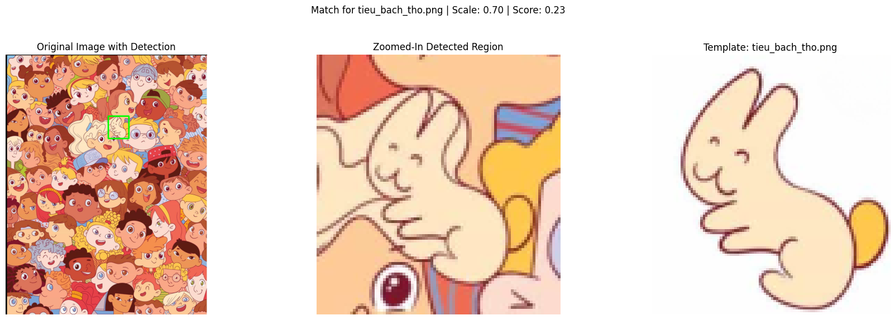

# Multi-Modal Multi-Scale Template Matching in OpenCV

This repository contains Python scripts demonstrating different techniques for finding template images within a larger source image, accounting for variations in scale. Three main approaches are explored:

1.  **Adaptive Sharpening + Grayscale Matching:** Enhances edges using sharpening and adaptive thresholding before performing standard multi-scale template matching on grayscale images.
2.  **Dominant Color + Masked Color Matching:** Identifies the dominant color(s) of the template using K-Means clustering in HSV space, creates masks based on these colors for both the template and the source image, and then performs multi-scale matching on the masked color images.
3.  **Edge-Based Matching:** Uses the Canny edge detector to create edge maps of the source image and the template, and then performs multi-scale matching directly on these edge maps.

## Example Output

Here's an example of the script's output, showing a detected template within a source image:



## Features

*   **Multi-Scale Detection:** Finds templates even if they appear larger or smaller in the source image compared to the template image.
*   **Multiple Matching Strategies:**
    *   Grayscale matching with adaptive sharpening preprocessing.
    *   Color-based matching using dominant HSV color segmentation and masking.
    *   Edge-based matching using Canny edge maps.
*   **Preprocessing Options:** Includes functions for sharpening, adaptive thresholding, unsharp masking, and morphological opening.
*   **Visualization:** Uses Matplotlib to display the source image with the detected template bounded by a rectangle, a zoomed-in view of the detection, and the template image itself. Additional visualizations (like masks and edge maps) are provided depending on the method.
*   **Customizable Parameters:** Allows adjustment of scale ranges, steps, matching methods, clustering parameters, and Canny thresholds.

## Requirements

*   Python 3.x
*   OpenCV (`opencv-python`)
*   NumPy
*   Matplotlib

You can install the required libraries using pip:

```bash
pip install opencv-python numpy matplotlib